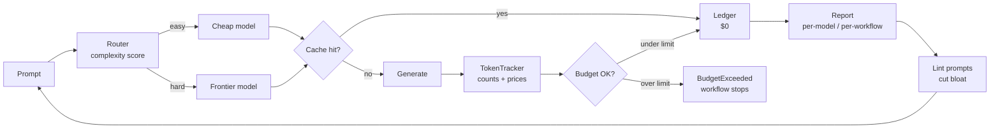

# tokengov

**Treat LLM spend like cloud spend.**

`tokengov` is a lightweight governance toolkit for LLM workflows: track
tokens per request, enforce per-workflow dollar budgets, cache responses
(exact + semantic), route easy prompts to cheap models, and lint your system
prompts for bloat. It gives an LLM feature the same cost discipline a
well-run platform team applies to EC2 — because token spend *is* compute
spend.

No servers, no SaaS, no API keys required to run the demo. Two dependencies
(`pydantic`, `tiktoken`), pure Python 3.10+.

## The governance loop



## Install

```bash
pip install .            # from a checkout
pip install ".[dev]"     # with pytest + ruff
```

## Usage

### 1. Track tokens and cost per request

```python
from tokengov import track, build_report

with track("gpt-4o", workflow="support-bot") as t:
    t.count_input(prompt)  # or an int from your client's usage field
    completion = client.chat(...)
    t.count_output(completion)

print(build_report().render())
```

### 2. Enforce per-workflow budgets

```python
from tokengov import Budget, BudgetExceeded, budget_guard, track

budget = Budget(limit=5.00, label="nightly-etl", warn_at=0.8)
try:
    with budget_guard(budget), track("gpt-4o-mini", workflow="nightly-etl"):
        rows = etl_step()
except BudgetExceeded:
    alert("nightly-etl hit its $5 ceiling — investigate before retrying")
```

Or as a decorator for whole functions:

```python
from tokengov import budgeted


@budgeted("gpt-4o-mini", limit=0.10, workflow="summarize")
def summarize(tracker, text: str) -> str:
    tracker.count_input(text)
    return client.chat(text)
```

### 3. Cache responses (exact + semantic)

```python
from tokengov import TwoTierCache

cache = TwoTierCache(ttl_seconds=600, max_entries=1000, similarity_threshold=0.95)
cache.set(prompt, model, response)
answer = cache.get(prompt, model)  # exact or near-duplicate hit
print(cache.stats.hit_rate)
```

The semantic tier uses a deterministic hashing-vector embedding (no network,
no weights). Swap in a real embedder any time:

```python
TwoTierCache(embed_fn=my_embedding_model.encode)
```

### 4. Route easy prompts to cheap models

```python
from tokengov import Router

router = Router(cheap_model="gpt-4o-mini", frontier_model="gpt-4o")
choice = router.route("Summarize this paragraph in one sentence.")
print(choice.model)  # gpt-4o-mini
print(choice.rationale)  # [cheap] no complexity signals fired (score 0.00)

hard = router.route(
    "Derive the trade-offs between two-phase commit and Raft, "
    "and output a JSON table of failure modes."
)
print(hard.model)  # gpt-4o
print(hard.rationale)  # [frontier] score 0.75 >= 0.50: reasoning-demand, ...
```

The classifier is an explainable weighted heuristic — length, reasoning
keywords, structured-output demands, domain terms. No opaque ML. Replace it
later without touching anything else:

```python
Router(cheap_model=..., frontier_model=..., classifier_fn=my_real_classifier)
```

### 5. Report spend

```bash
tokengov prices                        # pricing table
tokengov report                        # render this process's ledger
tokengov report --input ledger.json    # render an exported ledger
tokengov report --csv > spend.csv      # feed your finops dashboard
```

### 6. Lint prompts for bloat

```bash
tokengov lint prompts/system.txt
```

```text
prompts/system.txt:WARN  filler:politeness-padding (line 3): 2x filler phrase ... [~2 tokens]
prompts/system.txt:ERROR duplicated-instruction (line 9): line duplicates line 4 ... [~11 tokens]
prompts/system.txt:ERROR oversized-system-prompt (line 1): prompt is 1,203 tokens, 691 over the 512-token ceiling (~$0.000104/call at gpt-4o-mini input rates) [~691 tokens]

3 finding(s), ~704 tokens recoverable.
```

### 7. Run the end-to-end demo (zero API keys)

```bash
python examples/governed_chat.py
```

A mock LLM client drives the full stack — routing, cache, budget, tracker,
report — and prints the final cost table.

## Why I built this

I've spent 13+ years running engineering teams, and the most expensive
sentence in any architecture review is *"we'll optimize the LLM bill
later."* Later is where budgets go to die. The teams I've led that treated
token spend as a first-class operational metric — measured per workflow,
budgeted like cloud spend, and reviewed in the same forum as AWS bills —
routinely cut inference costs by 40–70% without degrading user-facing
quality. Token efficiency isn't a prompt trick; it's an engineering culture
artifact: you get what you instrument, you keep what you enforce in CI.

`tokengov` is my reference implementation of that culture in a box:

* **Measurement before optimization** — per-workflow ledgers make cost a
  debuggable signal, not a monthly surprise.
* **Guardrails, not guidelines** — budgets that *fail the call* (like a CI
  check) beat wiki pages that nobody reads.
* **Cheap by default, expensive by justification** — routing with a written
  rationale turns "why is this on the frontier model?" into a reviewable
  artifact.
* **Explainability over cleverness** — the router ships as weighted rules you
  can defend in a design review; a learned classifier can plug in later.

## Design docs

* [High-Level Design](docs/hld.md) — the governance loop and module map
* [Low-Level Design](docs/lld.md) — data structures, cache internals, ledger schema
* [ADR 0001: Explainable heuristics over opaque ML for routing](docs/adr/0001-explainable-heuristics-over-opaque-ml-for-routing.md)
* [ADR 0002: Contextvar-scoped tracking](docs/adr/0002-contextvar-scoped-tracking.md)

## Roadmap

- [ ] Async-first `TokenTracker` with provider adapters (OpenAI, Anthropic)
      that auto-report usage fields
- [ ] Budget backends: Redis for multi-process enforcement, file-based for CI
- [ ] Router signal calibration CLI — score prompts from production traffic
      and re-fit weights
- [ ] `tokengov lint --ci` mode with a configurable token budget gate for
      pre-commit / PR checks
- [ ] Prometheus exporter for the ledger
- [ ] Cost allocation tags propagated from request headers into reports

## License

MIT — see [LICENSE](LICENSE).
