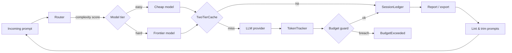

# tokengov — High-Level Design

## Purpose

`tokengov` gives LLM-backed features the same cost-governance loop that
platform teams apply to cloud infrastructure: **observe → attribute →
enforce → optimize**. Token spend is compute spend; it deserves meters,
budgets, and reviewable decisions rather than monthly invoice archaeology.

## The governance loop

Every request flows through the same five stages:

1. **Route** — an explainable complexity score picks the cheapest adequate
   model. The decision ships with a written rationale.
2. **Cache** — an exact lookup first; a semantic (hashing-vector cosine)
   lookup second. Hits bypass the provider entirely: zero tokens, zero cost.
3. **Track** — prompt/response tokens are counted and priced against the
   registered rate card, attributed to a workflow label.
4. **Enforce** — budgets attached to the ledger are charged on every record.
   Soft warnings at 80%; a hard breach raises `BudgetExceeded`, stopping the
   workflow like a CI failure rather than a polite log line.
5. **Report** — the ledger aggregates into per-model and per-workflow cost
   tables, JSON/CSV exports, and a naive 30-day projection. Prompt linting
   feeds oversized prompts back into the loop.

## Module map

| Module      | Responsibility                                        | Key types                          |
|-------------|-------------------------------------------------------|------------------------------------|
| `pricing`   | Rate card + cost calculation                          | `ModelPricing`, `calc_cost`        |
| `tracker`   | Context-local token counting, session ledger          | `TokenTracker`, `SessionLedger`, `track` |
| `budget`    | Dollar ceilings, warnings, breach semantics           | `Budget`, `BudgetExceeded`         |
| `cache`     | Two-tier exact + semantic response cache              | `TwoTierCache`, `CacheStats`       |
| `router`    | Explainable complexity classification → model tier    | `Router`, `ModelChoice`            |
| `report`    | Ledger → tables, exports, projections                 | `Report`, `build_report`           |
| `lint`      | Prompt-bloat findings with token savings              | `LintFinding`, `lint_text`         |
| `cli`       | `prices`, `report`, `lint` subcommands                | argparse entry point               |

## Design principles

1. **Offline-first.** No network calls anywhere in the library. The semantic
   cache embedder is a deterministic hashing trick; the demo uses a mock
   client. Everything runs — and every test passes — without connectivity.
2. **Two dependencies only.** `pydantic` for schema validation, `tiktoken`
   for token counting. The toolkit must install anywhere a Python project
   lives.
3. **Explainability over cleverness.** The router is weighted rules with a
   printed rationale. Every number in a report can be traced to a rate-card
   entry and a token count.
4. **Fail closed on money.** Unknown models raise `KeyError` (never silently
   price at $0). Budget breaches raise. Malformed ledger exports fail schema
   validation. Financial correctness beats convenience.
5. **Extension over configuration.** Runtime hooks (`register_pricing`,
   `classifier_fn`, `embed_fn`) let teams swap internals without forking.

## Deployment shapes

- **In-process SDK** (primary): import and wrap LLM call sites.
- **CLI**: `prices`, `report --input ledger.json`, `lint prompts/`.
- **CI gate** (roadmap): `lint --ci` fails builds whose system prompts exceed
  a token budget.
